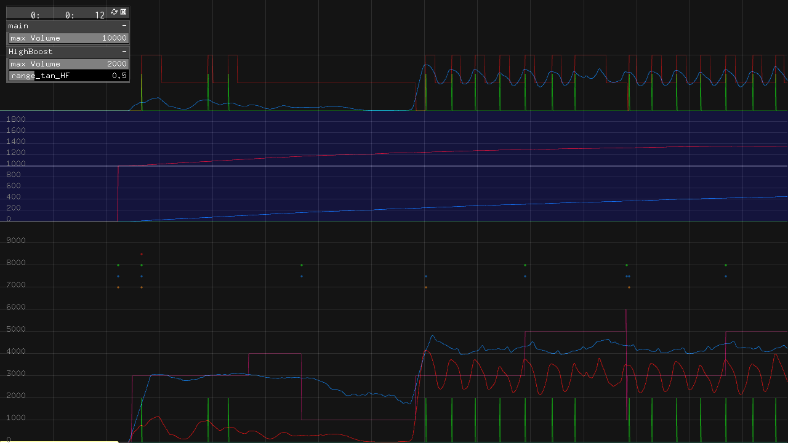

#data__work__AutoMagic_Director

##環境
*	OS X El Capitan(10.11.6)
*	Xcode : 7.2
*	oF : 0.9.0

##add on

##Contents
work__AutoMagic_Directorの検討data.  
*	Filterout check
*	output DesignParamCheck
*	triangle フーリエ級数

  

##Device
*	Audio I/F  
	Focusrite:Clarett 2Pre(thunderbolt model).  

##note

